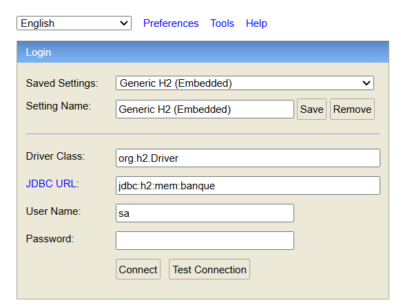
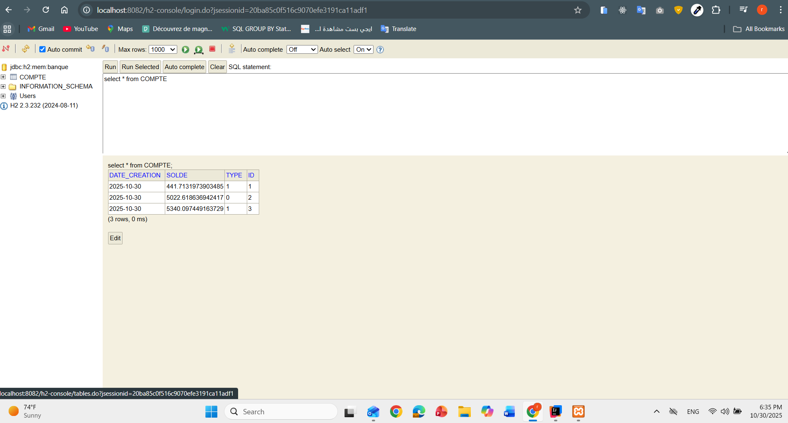
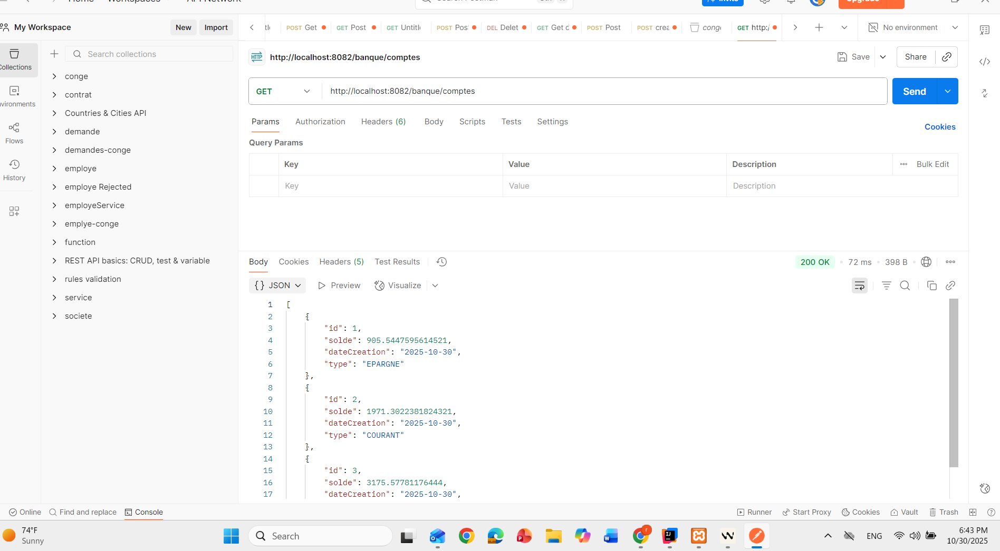
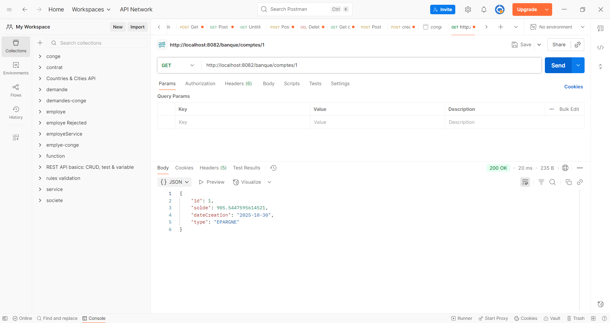
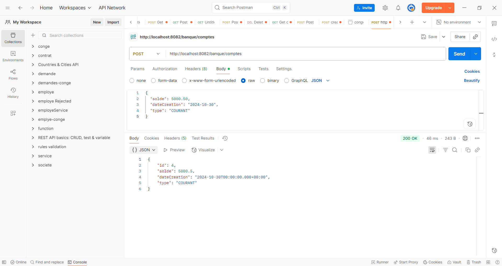
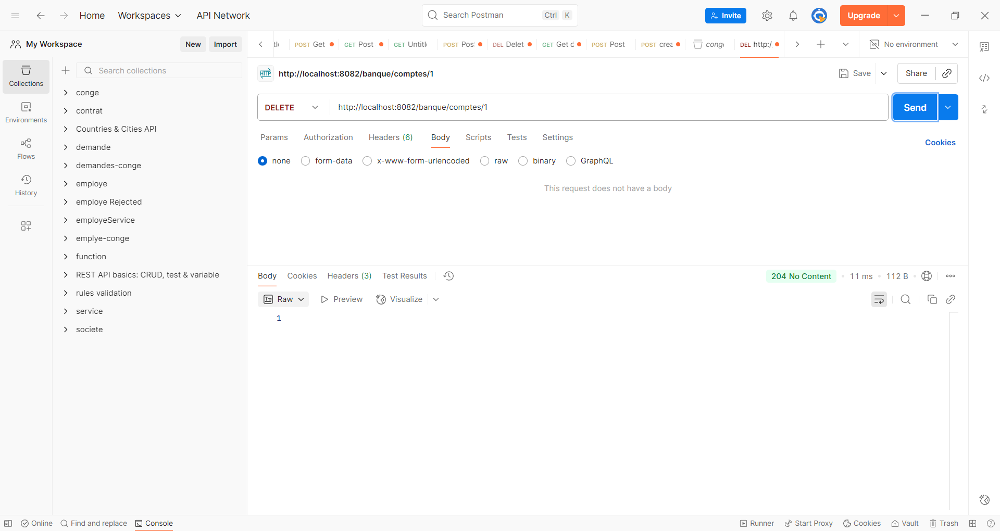

# Banque API - JAX-RS REST Service

A Spring Boot application using JAX-RS (Jersey) to manage bank accounts with full CRUD operations.

## 🚀 Technologies

- **Spring Boot 3.5.7**
- **JAX-RS (Jersey)** - REST API
- **Spring Data JPA** - Database access
- **H2 Database** - In-memory database
- **Lombok** - Reduce boilerplate code
- **Java 17**

## 📋 Prerequisites

- Java 17 or higher
- Maven 3.6+

## 🔧 Installation & Setup

1. **Clone the repository**
```bash
git clone <repository-url>
cd jaxrs
```

2. **Build the project**
```bash
mvn clean install
```

3. **Run the application**
```bash
mvn spring-boot:run
```

The application will start on **http://localhost:8082**

## 📊 Database

The application uses an **H2 in-memory database**:
- **URL**: `jdbc:h2:mem:banque`
- **Console**: http://localhost:8082/h2-console (if enabled)
- Data is cleared on application restart

## 📐 Entity Structure

### Compte (Account)

```json
{
  "id": 1,
  "solde": 5000.50,
  "dateCreation": "2024-10-30",
  "type": "COURANT"
}
```

**Fields:**
- `id` (Long) - Auto-generated identifier
- `solde` (double) - Account balance
- `dateCreation` (Date) - Creation date (format: yyyy-MM-dd)
- `type` (TypeCompte) - Account type: `COURANT` or `EPARGNE`



## 🌐 API Endpoints

Base URL: `http://localhost:8082/banque`

All endpoints support both **JSON** and **XML** formats.

### 1. Get All Accounts

**Request:**
```http
GET /banque/comptes
Accept: application/json
```


**Response:** `200 OK`
```json
[
  {
    "id": 1,
    "solde": 5000.50,
    "dateCreation": "2024-10-30",
    "type": "COURANT"
  },
  {
    "id": 2,
    "solde": 15000.00,
    "dateCreation": "2024-10-29",
    "type": "EPARGNE"
  }
]
```

---

### 2. Get Account by ID

**Request:**
```http
GET /banque/comptes/{id}
Accept: application/json
```

**Example:**
```http
GET /banque/comptes/1
```


**Response:** `200 OK`
```json
{
  "id": 1,
  "solde": 5000.50,
  "dateCreation": "2024-10-30",
  "type": "COURANT"
}
```

**Response:** `404 Not Found` (if account doesn't exist)
```json
null
```

---

### 3. Create New Account

**Request:**
```http
POST /banque/comptes
Content-Type: application/json
Accept: application/json
```

**Body:**
```json
{
  "solde": 5000.50,
  "dateCreation": "2024-10-30",
  "type": "COURANT"
}
```

**Response:** `200 OK`
```json
{
  "id": 1,
  "solde": 5000.50,
  "dateCreation": "2024-10-30",
  "type": "COURANT"
}
```

**Note:** Do not include `id` in the request body (auto-generated).

---

### 4. Update Account

**Request:**
```http
PUT /banque/comptes/{id}
Content-Type: application/json
Accept: application/json
```

**Example:**
```http
PUT /banque/comptes/1
```


**Body:**
```json
{
  "solde": 7500.75,
  "dateCreation": "2024-10-30",
  "type": "EPARGNE"
}
```

**Response:** `200 OK`
```json
{
  "id": 1,
  "solde": 7500.75,
  "dateCreation": "2024-10-30",
  "type": "EPARGNE"
}
```

**Response:** `404 Not Found` (if account doesn't exist)
```json
null
```

---

### 5. Delete Account

**Request:**
```http
DELETE /banque/comptes/{id}
Accept: application/json
```

**Example:**
```http
DELETE /banque/comptes/1
```


**Response:** `204 No Content`

---

## 🧪 Testing with Postman

### Quick Setup

1. **Import Collection**: Create a new collection named "Banque API"
2. **Set Base URL**: `http://localhost:8082/banque`
3. **Configure Headers**: 
   - `Content-Type: application/json`
   - `Accept: application/json`

### Sample Test Sequence

#### Step 1: Create an Account
```
POST http://localhost:8082/banque/comptes
Content-Type: application/json

{
  "solde": 5000,
  "dateCreation": "2024-10-30",
  "type": "COURANT"
}
```

#### Step 2: Get All Accounts
```
GET http://localhost:8082/banque/comptes
```

#### Step 3: Get Specific Account
```
GET http://localhost:8082/banque/comptes/1
```

#### Step 4: Update Account
```
PUT http://localhost:8082/banque/comptes/1
Content-Type: application/json

{
  "solde": 7500.25,
  "dateCreation": "2024-10-30",
  "type": "EPARGNE"
}
```

#### Step 5: Delete Account
```
DELETE http://localhost:8082/banque/comptes/1
```

---

## 📝 Testing with cURL

### Create Account
```bash
curl -X POST http://localhost:8082/banque/comptes \
  -H "Content-Type: application/json" \
  -H "Accept: application/json" \
  -d '{
    "solde": 5000,
    "dateCreation": "2024-10-30",
    "type": "COURANT"
  }'
```

### Get All Accounts
```bash
curl -X GET http://localhost:8082/banque/comptes \
  -H "Accept: application/json"
```

### Get Account by ID
```bash
curl -X GET http://localhost:8082/banque/comptes/1 \
  -H "Accept: application/json"
```

### Update Account
```bash
curl -X PUT http://localhost:8082/banque/comptes/1 \
  -H "Content-Type: application/json" \
  -H "Accept: application/json" \
  -d '{
    "solde": 7500.75,
    "dateCreation": "2024-10-30",
    "type": "EPARGNE"
  }'
```

### Delete Account
```bash
curl -X DELETE http://localhost:8082/banque/comptes/1 \
  -H "Accept: application/json"
```

---

## 🔄 XML Support

All endpoints support XML format. Simply change the headers:

**Headers:**
```
Content-Type: application/xml
Accept: application/xml
```

**XML Request Body Example:**
```xml
<Compte>
    <solde>5000.0</solde>
    <dateCreation>2024-10-30</dateCreation>
    <type>COURANT</type>
</Compte>
```

**XML Response Example:**
```xml
<?xml version="1.0" encoding="UTF-8"?>
<Compte>
    <id>1</id>
    <solde>5000.0</solde>
    <dateCreation>2024-10-30</dateCreation>
    <type>COURANT</type>
</Compte>
```

---

## 📂 Project Structure

```
jaxrs/
├── src/
│   ├── main/
│   │   ├── java/
│   │   │   └── ma/ws/jaxrs/
│   │   │       ├── JaxrsApplication.java          # Main class
│   │   │       ├── config/
│   │   │       │   └── MyConfig.java              # Jersey configuration
│   │   │       ├── controllers/
│   │   │       │   └── CompteRestJaxRSAPI.java    # REST endpoints
│   │   │       ├── entities/
│   │   │       │   ├── Compte.java                # Account entity
│   │   │       │   └── TypeCompte.java            # Account type enum
│   │   │       └── repositories/
│   │   │           └── CompteRepository.java      # JPA repository
│   │   └── resources/
│   │       └── application.properties             # Configuration
│   └── test/
│       └── java/
│           └── ma/ws/jaxrs/
│               └── JaxrsApplicationTests.java
├── pom.xml                                        # Maven dependencies
└── README.md
```

---

## ⚙️ Configuration

### application.properties

```properties
spring.application.name=jaxrs
spring.datasource.url=jdbc:h2:mem:banque
server.port=8082
```

### Change Server Port

Edit `application.properties`:
```properties
server.port=8080
```

---

## 📌 Important Notes

1. **Account Types**: Only `COURANT` (current account) or `EPARGNE` (savings account) are valid
2. **Date Format**: Use `yyyy-MM-dd` format for dates
3. **Auto-increment ID**: Don't include `id` when creating accounts
4. **In-memory Database**: All data is lost when the application stops
5. **Content Negotiation**: The API automatically handles JSON/XML based on headers

---

## 🐛 Troubleshooting

### Port Already in Use
```bash
# Change port in application.properties
server.port=8083
```

### Database Connection Issues
- Check H2 configuration in `application.properties`
- Verify the datasource URL is correct

### Jersey Not Found
```bash
# Rebuild the project
mvn clean install
```

---

## 📄 License

This project is open-source and available for educational purposes.

---

## 👤 Author

Developed with Spring Boot and JAX-RS (Jersey)

---

## 🤝 Contributing

1. Fork the project
2. Create your feature branch (`git checkout -b feature/AmazingFeature`)
3. Commit your changes (`git commit -m 'Add some AmazingFeature'`)
4. Push to the branch (`git push origin feature/AmazingFeature`)
5. Open a Pull Request
# TP-7-JAXRS-Jersey

